# Diagramas pedidos para o projeto
- Os diagramas foram feitos utilizando plantuml e mermaid:

## Diagrama de classe:

- Por imagem:
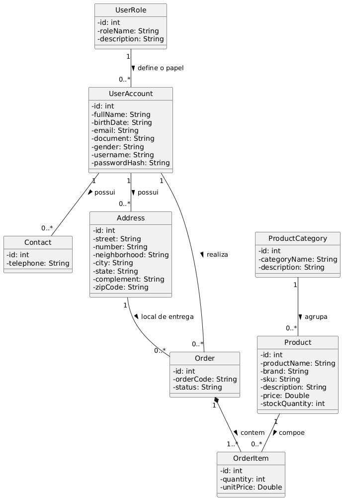

- Codificação
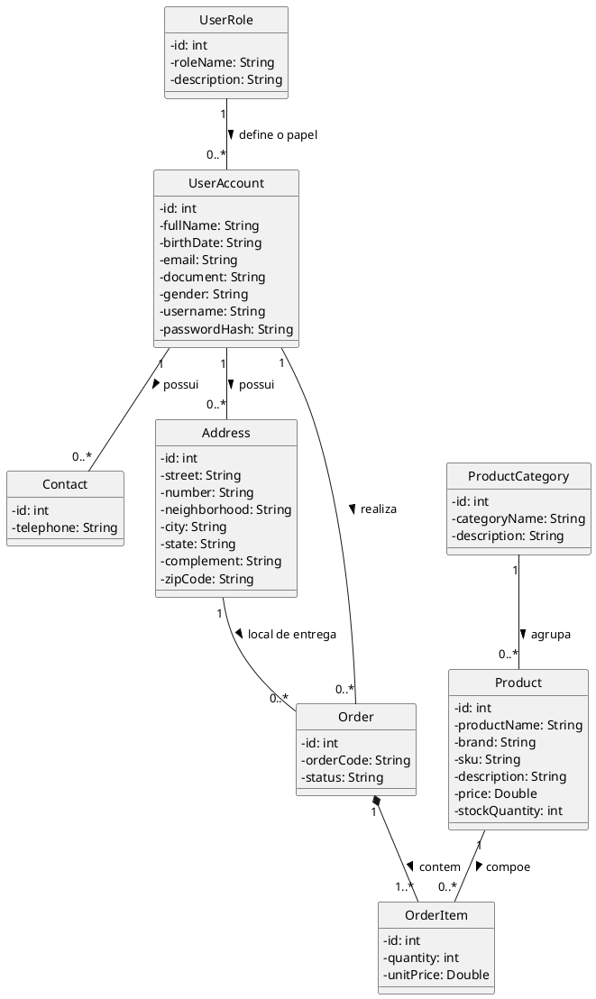

## Diagrama de pacotes:

- Por imagem:
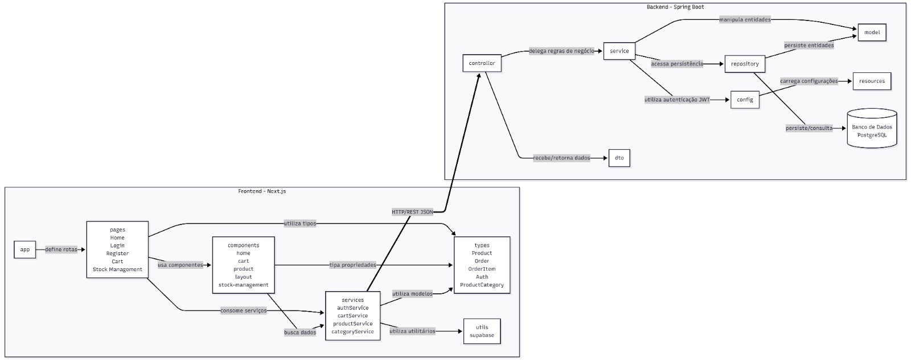

- Codificação:
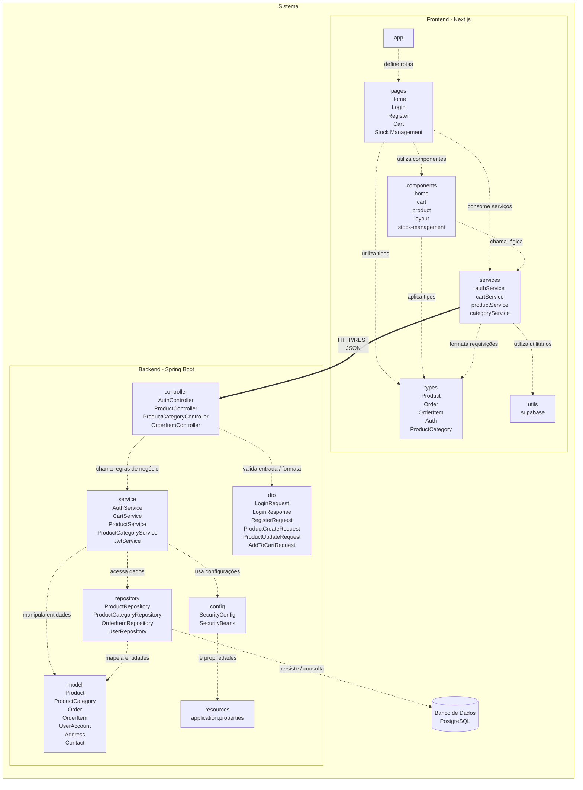

## Diagramas de sequencia:

### Criar Produto
- Por imagem:

- Codificação:

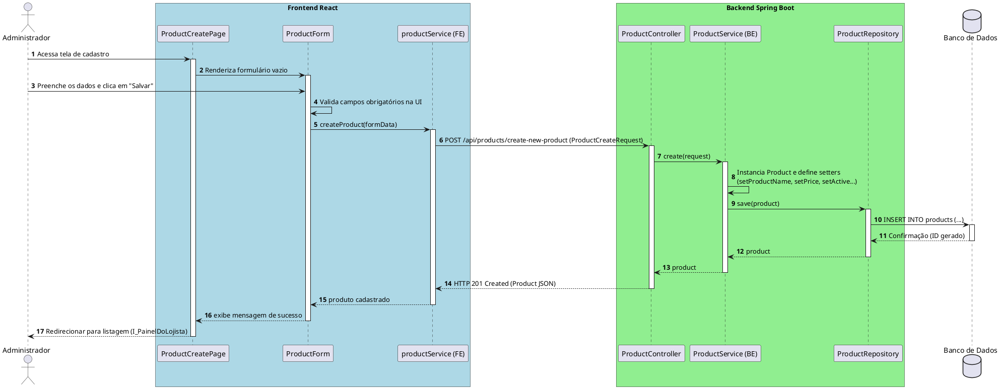

### Alterar Produto
- Por imagem:

- Codificação:

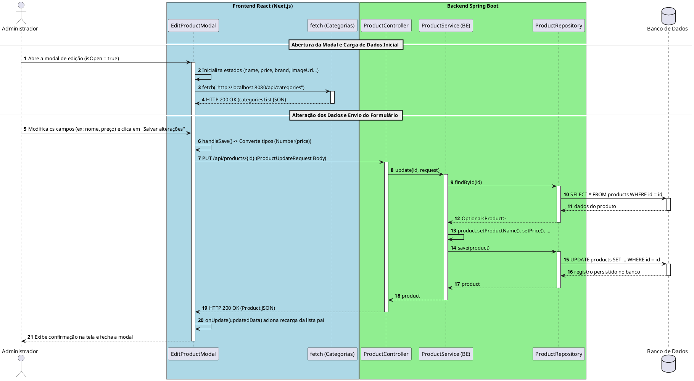

### Consultar Produtos do Catálogo
- Por imagem:

- Codificação:
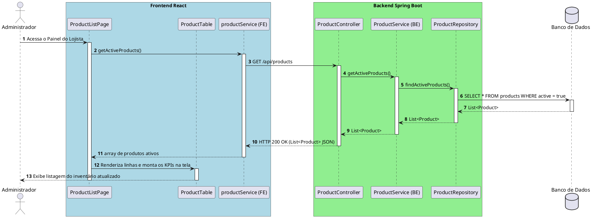

### Excluir Produto
- Por imagem:
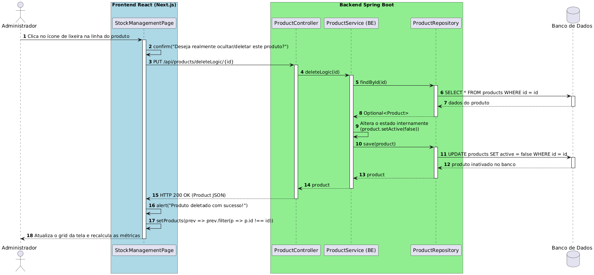

- Codificação:
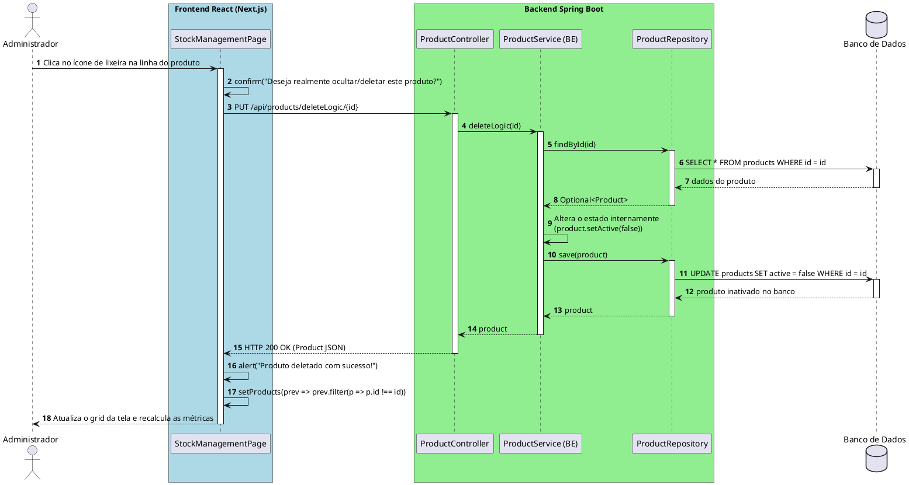

### Finalizar Pedido
- Por imagem:

- Codificação:
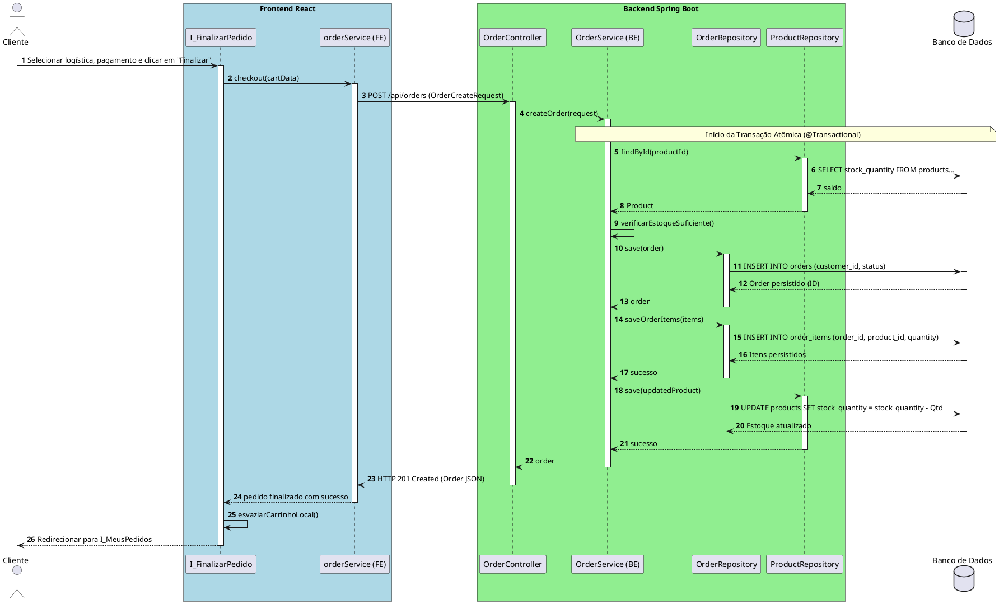

### Consultar Detalhes do Pedido
- Por imagem:

- Codificação:
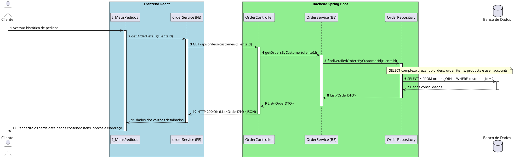

### Atualizar Status do Pedido
- Por imagem:

- Codificação:
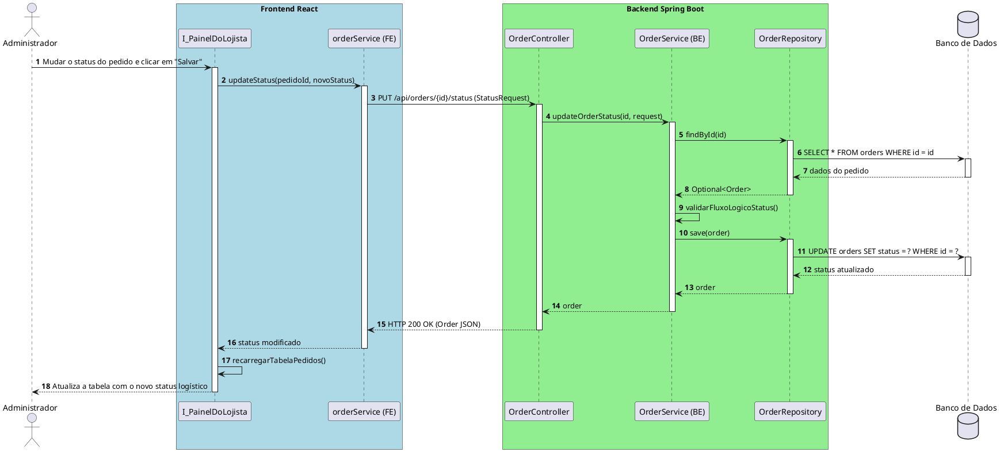

### Cancelar Pedido
- Por imagem:

- Codificação:
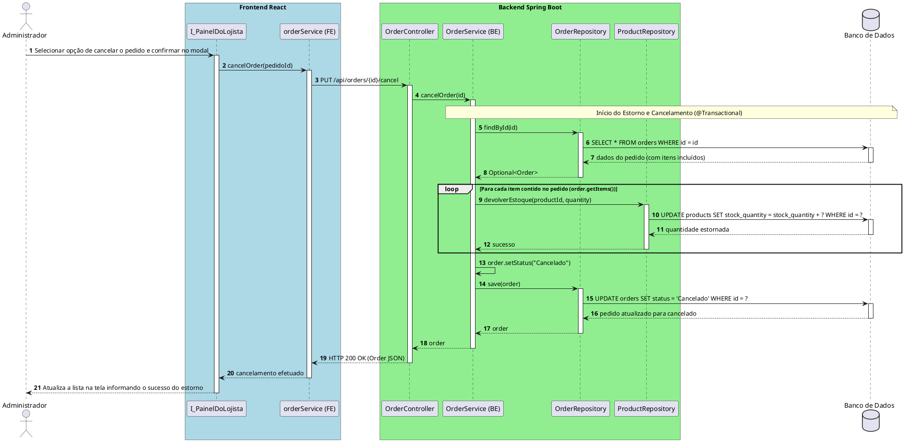
