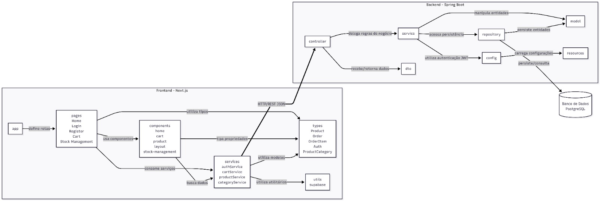

# Diagramas pedidos para o projeto
- Os diagramas foram feitos utilizando mermaid:

## Diagrama de classe:

- Como foi feito pelo plantuml, não tem como plotar por codificação:


## Diagrama de pacotes:

- Por imagem:


- Codificação:
```mermaid
flowchart LR

    subgraph SISTEMA["Sistema"]

        subgraph FRONT["Frontend - Next.js"]

            APP["app"]

            PAGES["pages
            Home
            Login
            Register
            Cart
            Stock Management"]

            COMPONENTS["components
            home
            cart
            product
            layout
            stock-management"]

            SERVICES_F["services
            authService
            cartService
            productService
            categoryService"]

            TYPES["types
            Product
            Order
            OrderItem
            Auth
            ProductCategory"]

            UTILS_F["utils
            supabase"]

            APP -.->|"define rotas"| PAGES

            PAGES -.->|"utiliza componentes"| COMPONENTS
            PAGES -.->|"consome serviços"| SERVICES_F
            PAGES -.->|"utiliza tipos"| TYPES

            COMPONENTS -.->|"chama lógica"| SERVICES_F
            COMPONENTS -.->|"aplica tipos"| TYPES

            SERVICES_F -.->|"formata requisições"| TYPES
            SERVICES_F -.->|"utiliza utilitários"| UTILS_F
        end

        subgraph BACK["Backend - Spring Boot"]

            CONTROLLER["controller
            AuthController
            ProductController
            ProductCategoryController
            OrderItemController"]

            SERVICE["service
            AuthService
            CartService
            ProductService
            ProductCategoryService
            JwtService"]

            REPOSITORY["repository
            ProductRepository
            ProductCategoryRepository
            OrderItemRepository
            UserRepository"]

            MODEL["model
            Product
            ProductCategory
            Order
            OrderItem
            UserAccount
            Address
            Contact"]

            DTO["dto
            LoginRequest
            LoginResponse
            RegisterRequest
            ProductCreateRequest
            ProductUpdateRequest
            AddToCartRequest"]

            CONFIG["config
            SecurityConfig
            SecurityBeans"]

            RESOURCES["resources
            application.properties"]

            CONTROLLER -.->|"chama regras de negócio"| SERVICE
            CONTROLLER -.->|"valida entrada / formata"| DTO

            SERVICE -.->|"acessa dados"| REPOSITORY
            SERVICE -.->|"manipula entidades"| MODEL
            SERVICE -.->|"usa configurações"| CONFIG

            REPOSITORY -.->|"mapeia entidades"| MODEL
            CONFIG -.->|"lê propriedades"| RESOURCES
        end
        
        DB[("Banco de Dados\nPostgreSQL")]

        SERVICES_F ==>|"HTTP/REST\nJSON"| CONTROLLER

        REPOSITORY -.->|"persiste / consulta"| DB
    end