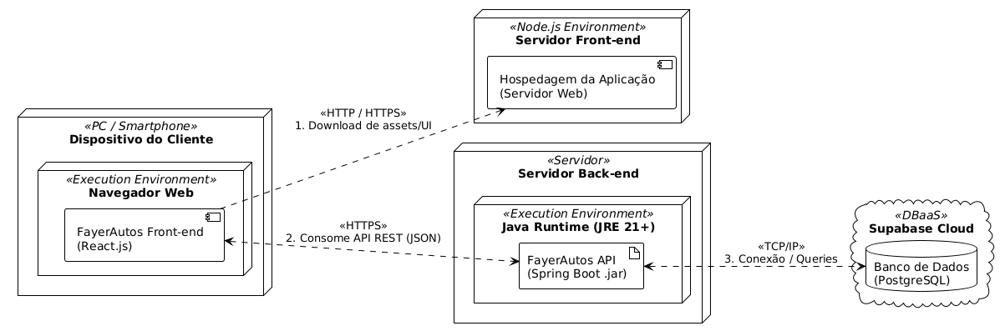
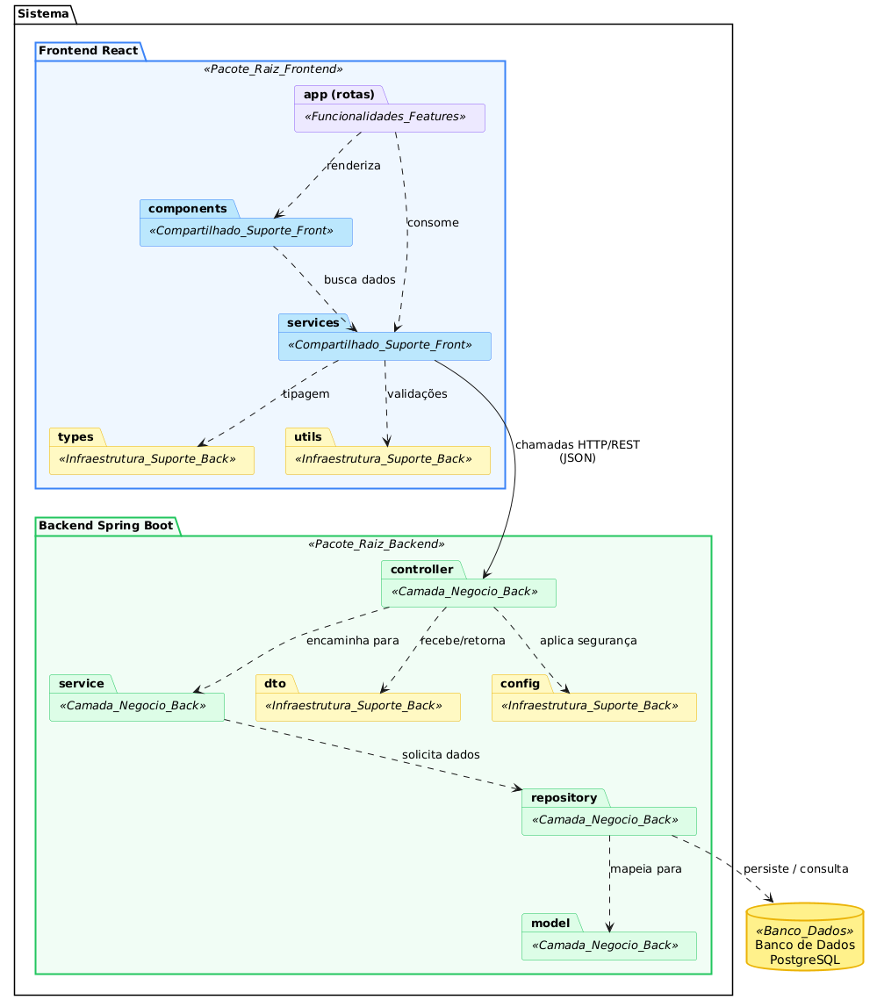
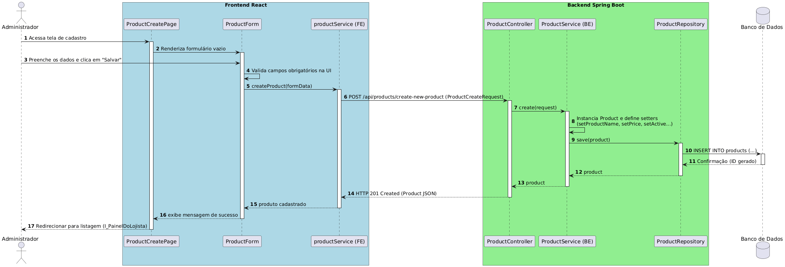
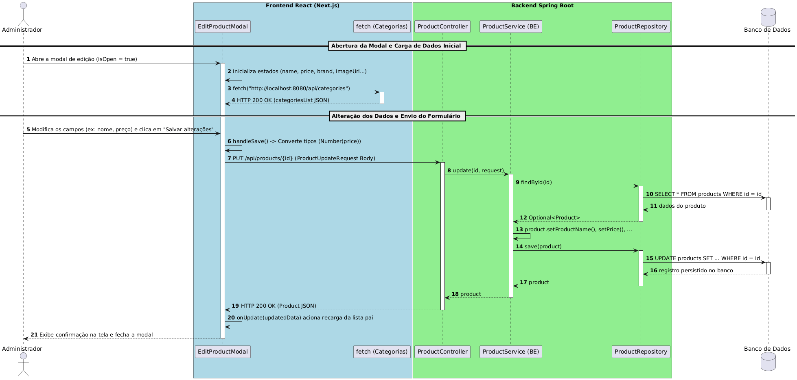
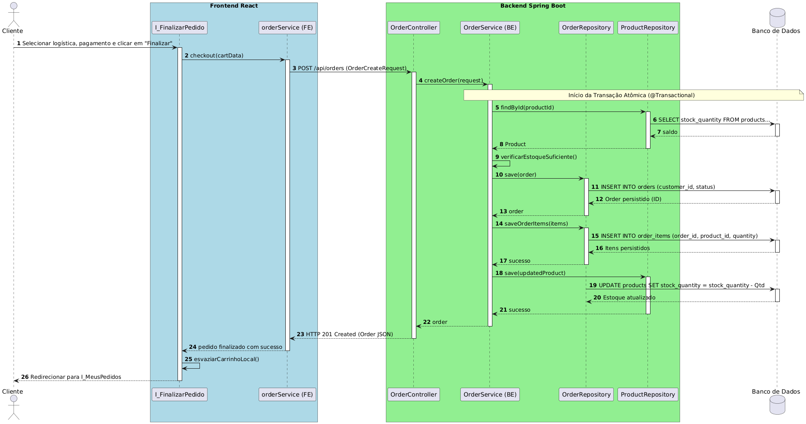
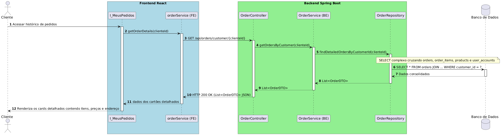
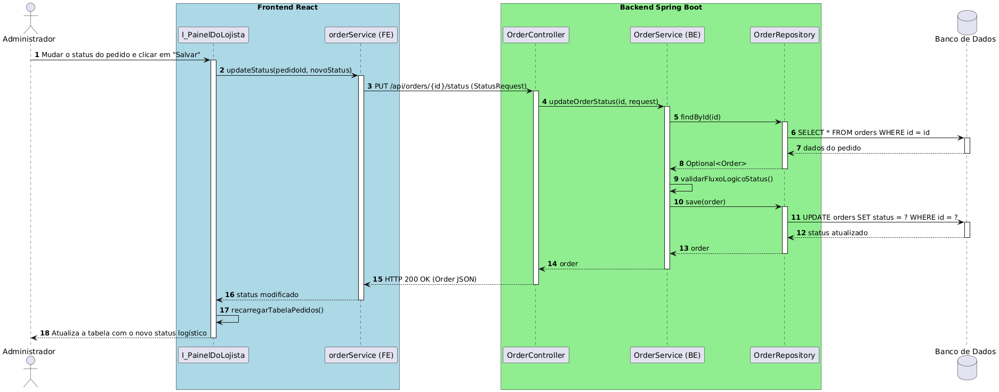
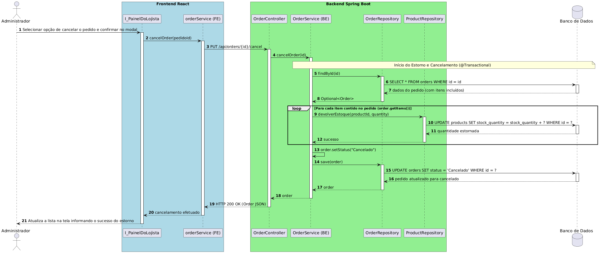

# Diagramas pedidos para o projeto

- Os diagramas foram feitos utilizando plantuml

## Diagrama de classe:

- Por imagem:
  

## Diagrama de implantação:

- Por imagem:
  

## Diagrama de pacotes:

- Por imagem:
  

## Diagramas de sequencia:

### Criar Produto

- Por imagem:
  

### Alterar Produto

- Por imagem:
  

### Consultar Produtos do Catálogo

- Por imagem:
  

### Excluir Produto

- Por imagem:
  

### Finalizar Pedido

- Por imagem:
  

### Consultar Detalhes do Pedido

- Por imagem:
  

### Atualizar Status do Pedido

- Por imagem:
  

### Cancelar Pedido

- Por imagem:
  
